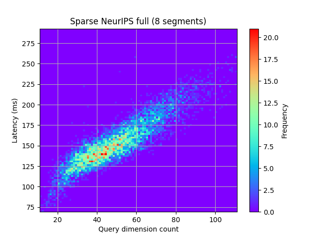

# sparse-vector-benchmark

## Context

This is a benchmarking tool for Qdrant's sparse vector implementation using the [NeurIPS 2023](https://big-ann-benchmarks.com/neurips23.html) datasets.

> This task is based on the common MSMARCO passage retrieval dataset, which has 8,841,823 text passages, encoded into sparse vectors using the SPLADE model. The vectors have a large dimension (about 30,000), but each vector in the base dataset has an average of approximately 120 nonzero elements. The query set contains 6,980 text queries, embedded by the same SPLADE model. The average number of nonzero elements in the query set is approximately 49 (since text queries are generally shorter). Given a sparse query vector, the index should return the top-k results according to the maximal inner product between the vectors.


## Datasets

This section quotes the [big-ann-benchmarks repo](https://github.com/harsha-simhadri/big-ann-benchmarks/blob/main/dataset_preparation/sparse_dataset.md).

| Name          | Description                | download link                                                                                | #rows     | ground truth                                                                              | 
|:--------------|----------------------------|----------------------------------------------------------------------------------------------|-----------|-------------------------------------------------------------------------------------------|
| `full`        | Full base dataset          | [5.5 GB](https://storage.googleapis.com/ann-challenge-sparse-vectors/csr/base_full.csr.gz)   | 8,841,823 | [545K](https://storage.googleapis.com/ann-challenge-sparse-vectors/csr/base_full.dev.gt)  |
| `1M`          | 1M slice of base dataset   | [636.3 MB](https://storage.googleapis.com/ann-challenge-sparse-vectors/csr/base_1M.csr.gz)   | 1,000,000 | [545K](https://storage.googleapis.com/ann-challenge-sparse-vectors/csr/base_1M.dev.gt)    |
| `small`       | 100k slice of base dataset | [64.3 MB](https://storage.googleapis.com/ann-challenge-sparse-vectors/csr/base_small.csr.gz) | 100,000   | [545K](https://storage.googleapis.com/ann-challenge-sparse-vectors/csr/base_small.dev.gt) |
| `queries.dev` | queries file               | [1.8 MB](https://storage.googleapis.com/ann-challenge-sparse-vectors/csr/queries.dev.csr.gz) | 6,980     | N/A                                                                                       |


The datasets need to be downloaded and extracted into the `data` folder.

## Setup project

* `pyenv install 3.10.10` - install python 3.10.10
* `pyenv local 3.10.10` - set python version
* `pip install virtualenv` - install venv manager
* `virtualenv venv` - create virtual env
* `source venv/bin/activate` - enter venv
* `pip install -r requirements.txt` - install dependencies

## Run benchmark

```
Usage: main.py [OPTIONS]

  Sparse vector benchmark tool for Qdrant.

Options:
  --host TEXT                  The host of the Qdrant server
  --skip-creation BOOLEAN      Whether to skip collection creation
  --dataset TEXT               Dataset to use: small, 1M, full
  --slow-ms INTEGER            Slow query threshold in milliseconds
  --search-limit INTEGER       Search limit
  --data-path TEXT             Path to the data files
  --segment-number INTEGER     Number of segments
  --analyze-data BOOLEAN       Whether to analyze data
  --check-groundtruth BOOLEAN  Whether to check results against ground truth
  --help                       Show this message and exit.
```

e.g. to create a collection from the `small` dataset:

```bash
python main.py --skip-creation false --dataset small
```
    
## Results

The results are stored in the `results` folder.


- 2D histogram of Latency per dimension count: 

- Histogram of data posting length distribution: 